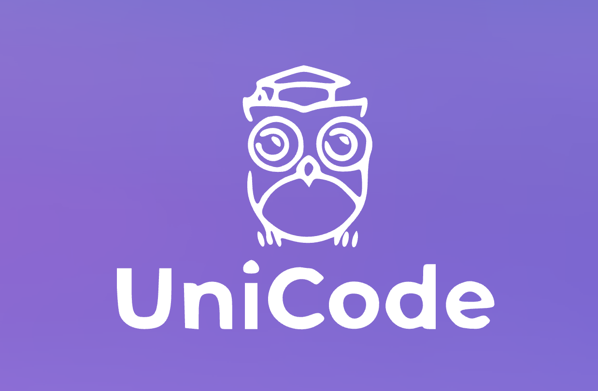

  

---

# UniCode

### A proof-of-concept platform application for creating, sitting, and assessing coding exams

One of the biggest challenges faced by Computer Science, Data Science and Software Engineering students is the inability to demostrate our true coding ability during tests and exams, as we exhaustedly try to make sure the indentation on our hand-written linked list class defintion is correct. Instead of plain old pen and paper, why not allow students to be assessed on a more realistic platform, removing the hassle of the scribble, and providing some of the staple creature comforts like syntax highlighting? (and yes, we remembered to turn AutoComplete off)!

For this reason we decided to develop **UniCode**, so that students and professors alike can enjoy the experience of learning and teaching how to code just a little bit more.

## **Description**

**UniCode** is an online test/exam platform for educational institutions that allows administrator users (teachers) to create and evaluate coding related tests, and for users/students to sit these tests and see results. It is designed to provide a friendly experience for studens and teachers without compromising the level of complexity required for developing the coding learning experience.

**UniCode** provides the ability to not only test students' theoretical knowledge but also their technical abilities. Teachers have the ability to select from three different questions assesment types: 

- **_Output_**: Based on an excerpt of code provided by the teacher, the student is required to enter the expected output. (automated marking).
- **_MCQ_**: Based on a written question and/or provided code, the student must select the best answer out of up to 4 possible options. (automated marking)
- **_Code_**: This is where the students get to have the most fun. Based on the question description provided by the teacher, the student can use the code editor to write their class, function or method, or whatever has been asked of them! These questions are flagged for manual marking by the teacher (we hope to have an in-browser code interpreter in the future)!

Another important functionality of **UniCode** is the ability of the teacher to organise all of their tests and students into their respective courses, choosing which tests to display to students and when.

## Two types of users

The platform is built to cater for two types of users: Teachers/Lecturers and Students. Their respective abilities within the platform are:

### Teacher/Lecturer

- Create, edit, delete, update coding tests and exams
- Organise tests and exams into courses
- Add/remove students from courses
- Have tests Live (visible to students) or hidden, with the flick of a switch
- Use a guided test marking dashboard
- Seamlessly provide student feedback

### Student

- Sit tests and exams set by teachers/lecturers
- View marks, and how they compare to other students
- View feedback from teachers
- View test solutions once made available

 
## **What's Next?**

We believe that **UniCode** has immense potential to keep growing to become an even more robust educational tool for students and teachers. As all developers know, development never ends, and as such here's a list of where we're at and what the next steps might be:

  - Increased language support (currently only Python)
  - Allow multiple teachers to administrate the same course
  - Fuzzy matching for 'Output' question submissions, potentially raising a 'needs marking' flag if a provided answer is close to the given solution
  - Allow teachers to save questions to use again later, and potentially share with other teachers!
  - Keeping students up to date with their marks and tests via email
  - Integration with educational institution's database
  - And the big goal for now: _get code running in the browser !!!_

 

**UniCode**: Because nobody likes writing code with a pen and pad
  
## Development Team

| **Johnny Barrett** | **Ivy Bui** | **Jesse Carter** | **Cesar Gonzalez** |
| :---: |:---:| :---:|:---:|

___

## License

- **[MIT license](http://opensource.org/licenses/mit-license.php)**
- Copyright 2020 ©
